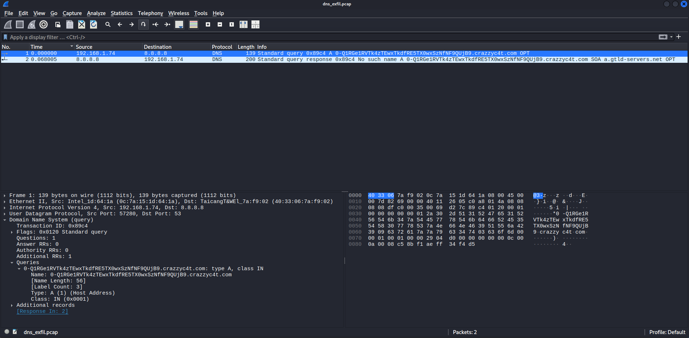

---
title: "DNS Exfiltration"
date: 2025-07-14
category: Cybersecurity
tags: [dns, exfiltration, wireshark, tshark, ctf]
---

# DNS Exfiltration Analysis

## Introduction

DNS is a foundational internet protocol used to resolve domain names into IP addresses. However, due to its widespread trust and typically unmonitored nature, DNS is also a prime target for data exfiltration. In DNS tunneling, attackers encode and embed data within DNS queries to bypass firewalls and network monitoring systems.

This post documents the forensic analysis of a network capture file (`dns_exfil.pcap`) containing suspicious DNS traffic. The objective is to investigate signs of exfiltration, identify the compromised internal host, reconstruct the exfiltrated data, and determine the attacker's infrastructure to solve ctf challenges.

---

  

## PCAP Overview

The capture file, `dns_exfil.pcap`, was analyzed using Wireshark and `tshark` on a Kali Linux system. The `.pcap` contains outbound DNS queries from a single internal IP address. The traffic pattern suggests potential data exfiltration via DNS tunneling.

  

Initial filtering of DNS traffic was done using the following command:

tshark -r dns_exfil.pcap -Y "dns.qry.name" -T fields -e dns.qry.name

## DNS Query Analysis

The packet capture file `dns_exfil.pcap` was analyzed using `tshark` to extract DNS query names. These queries revealed a suspicious pattern involving encoded subdomains, likely used for data exfiltration.

The following command was used to extract all DNS query names from the capture:

tshark -r dns_exfil.pcap -Y "dns.qry.name" -T fields -e dns.qry.name > queries.txt

  

This command reads the dns_exfil.pcap file using -r, applies a display filter -Y to include only DNS queries (dns.qry.name), outputs only the DNS query name field (-e dns.qry.name), and saves the output to queries.txt.

To view the extracted DNS queries:

  

Each query targets the domain crazzyc4t.com, but the subdomain appears to be Base64-encoded. The encoded string Q1RGe1RVTk4zTEwxTkdfRE5TX0wxSzNfNF9QUjB9 is likely the exfiltrated payload embedded within DNS queries.

To decode the string and verify the contents, the following command was executed:

  

This confirms that the attacker used DNS tunneling to exfiltrate data, embedding a Base64-encoded flag in the subdomain of a DNS query to an external, attacker-controlled domain. This method allows bypassing network monitoring tools that do not deeply inspect DNS payloads.

## Identifying the Exfiltrating Host

To determine which machine on the network was responsible for the DNS exfiltration, I inspected the source IP address of the DNS queries sent to the external domain `crazzyc4t.com`.

Using Wireshark, I examined packet number 1 in the capture. This packet is a standard DNS query requesting the A record for the suspicious domain:

  

The key information from the packet is:

- **Source IP**: `192.168.1.74`
- **Destination IP**: `8.8.8.8` (Google DNS)
- **Protocol**: DNS (UDP port 53)
- **Query Type**: A (host address)

This tells us that the machine with IP address `192.168.1.74` is initiating the outbound DNS queries that contain encoded subdomains. The response from `8.8.8.8` confirms that the query occurred and that the name does not resolve which is typical for DNS tunneling payloads sent to a controlled domain.

Therefore, based on the packet details and query behavior, the exfiltrating host is:
192.168.1.74

This IP represents the compromised internal system used by the attacker to tunnel data out of the network via DNS requests.
