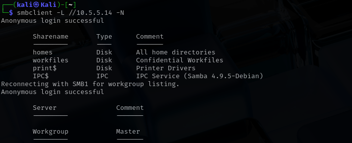
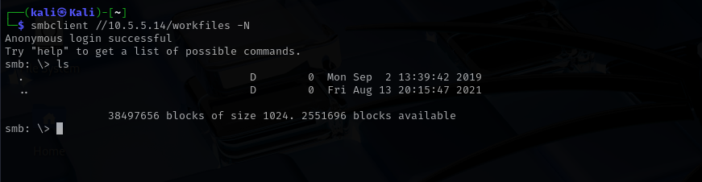

<p align="center">
  
</p>
To identify hosts running SMB services on the 10.5.5.0/24 network, I used the Nmap command nmap -p 139,445 --open 10.5.5.0/24 to scan for open TCP ports commonly associated with SMB: port 139 (NetBIOS Session Service) and port 445 (Microsoft Directory Services). The scan results revealed that the host 10.5.5.14, with the hostname gravemind.pc, had both ports 139 and 445 open. This indicates that the machine is running SMB services and is a viable target for further enumeration of shared resources.


## Enumerating SMB Shares on the Target

With the target host 10.5.5.14 confirmed to be running SMB services, I used the smbclient tool to enumerate the available shared directories. This step helps identify any unsecured or misconfigured shares that might expose sensitive files.

I ran the following command to perform an anonymous listing of shared resources:

```
smbclient -L //10.5.5.14 -N
```

-L lists the shares on the host.

-N tells smbclient to skip the password prompt and attempt anonymous login.

<p align="center">
  
</p>

The share named workfiles stands out, as it is labeled "Confidential Workfiles" and is accessible without authentication. This may indicate a misconfiguration, since sensitive data should not be publicly available.

In addition, smbclient attempted to list the workgroup and found no servers explicitly defined, but it did confirm that anonymous browsing is enabled on the host.

This kind of open access could be exploited further for instance, by connecting to the workfiles share and downloading exposed documents or scripts.

## Attempting to Access the workfiles Share

After identifying that the workfiles SMB share was available and marked as "Confidential Workfiles," I connected to it using the following command:

```
smbclient //10.5.5.14/workfiles -N
```

<p align="center">
  
</p>
The login was successful, and I was dropped into an interactive SMB session.

At the SMB prompt, I used the ls command to list the contents of the share.The output showed no visible files, only the default directory entries
