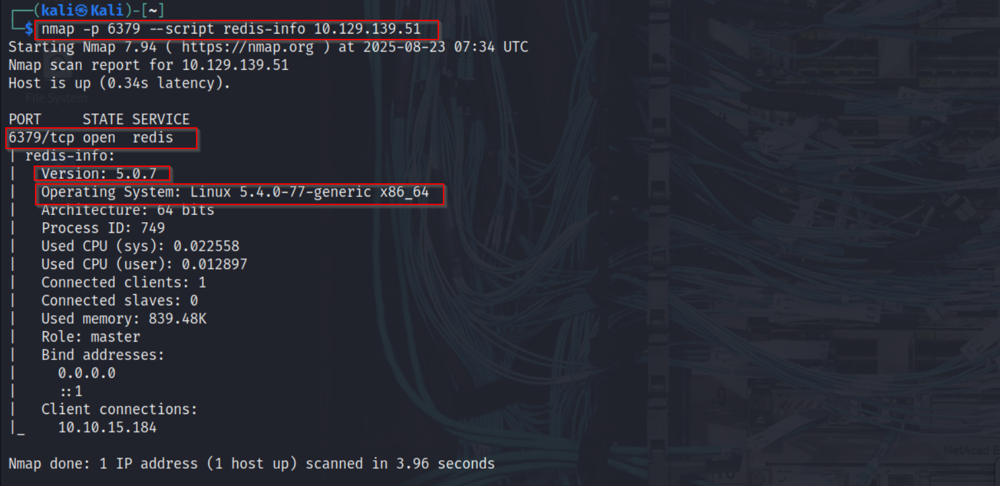
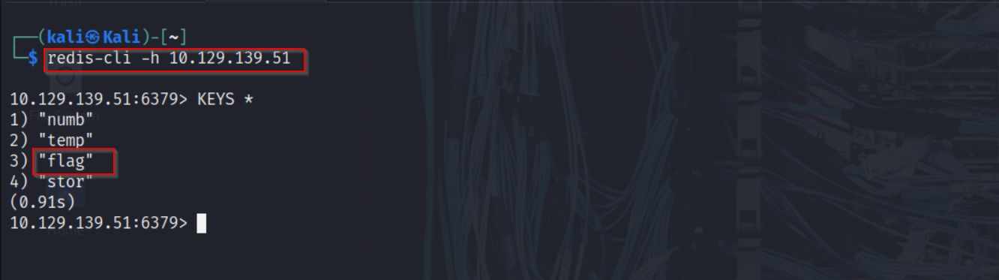
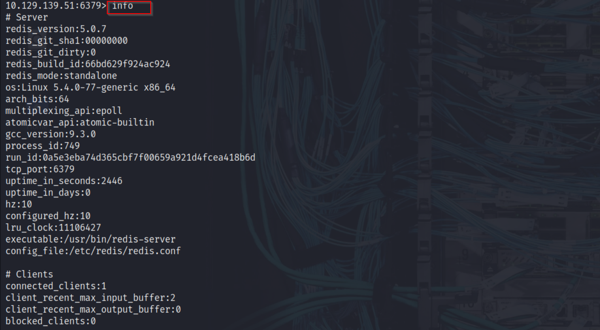
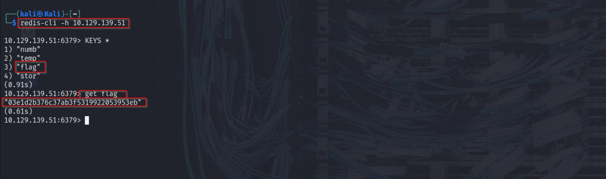

## What Is Redis?  

Redis (**REmote DIctionary Server**) is an **open-source, in-memory key-value database**.  
It stores data primarily in **RAM**, making it extremely fast.  
It supports multiple data structures such as **strings, lists, sets, and hashes**, and is widely used for caching, real-time analytics, and session storage.  

- **Default port:** 6379/tcp  
- **Type:** In-Memory Database  
- **Modes:** Standalone, Master-Slave Replication, Cluster  

---

## Nmap Scan  

To start, I performed an **Nmap scan** to check for an exposed Redis service:

```bash
nmap -p 6379 --script redis-info 10.129.164.202
```


redis-cli -h 10.129.139.51
<p align="center">
  
</p>

## Enumerating Redis

```python 
Listing Keys

KEYS *
```

<p align="center">
  
</p>

## Checking Server Info

```python
INFO
```
This command revealed server details, memory usage, connected clients, replication role, and more.

<p align="center">
  
</p>

Retrieving Data
The most interesting key was flag. Using the GET command:

GET flag
Result:
<p align="center">
  
</p>


## Other Useful Redis Commands
During enumeration, several other Redis commands proved useful:

## Check key type

```python
TYPE <key>
Check if a key exists
EXISTS <key>
```

```python
List all databases and keys
INFO keyspace
```

```python
Retrieve all elements of a list
LRANGE <key> 0 -1
```
```python
Retrieve all members of a set

SMEMBERS <key>
```
```python
Retrieve all fields and values of a hash

HGETALL <key>
```

```python
Switch databases

SELECT <db_number>
```