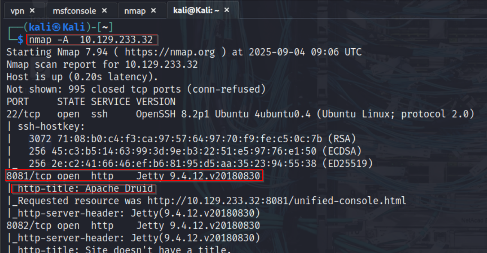
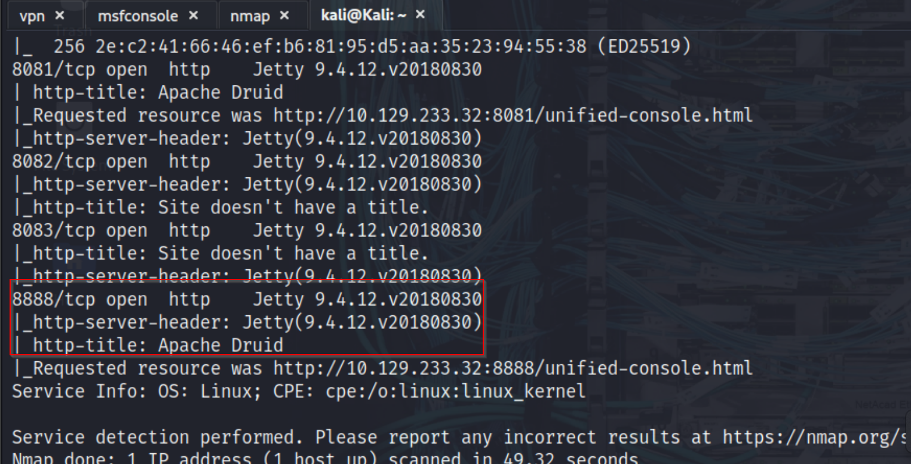
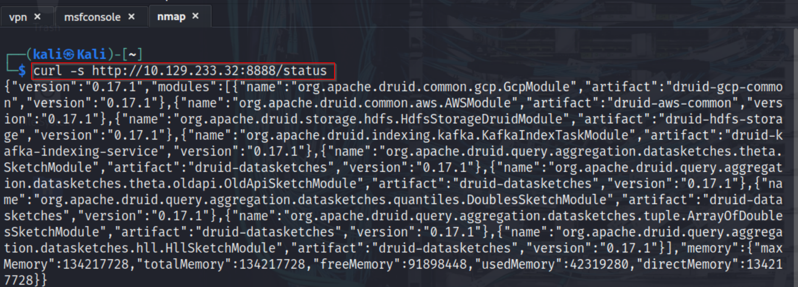
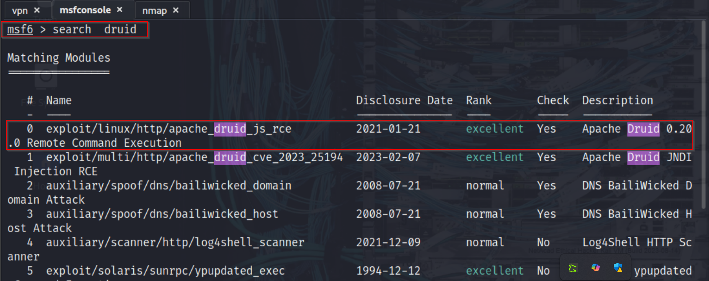
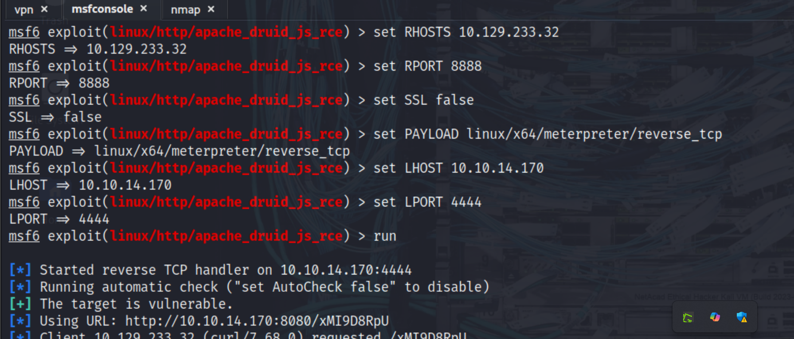
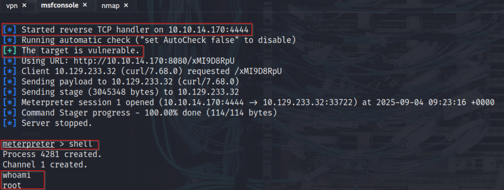
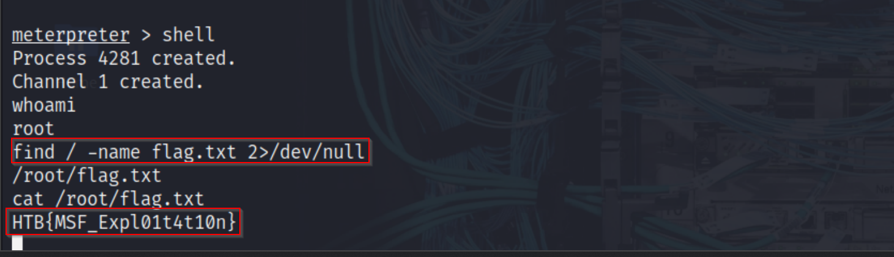

## Service Enumeration with Nmap

I begun assessment with an Nmap service and version detection scan against the target host 10.129.233.32. The scan revealed several open ports, including SSH on port 22 and multiple web services running on ports 8081, 8082, 8083, and 8888. Each of these web services identified itself as running under Jetty, and further inspection of the HTTP titles confirmed that they were part of an Apache Druid deployment. One key detail was that port 8090, typically used by the Druid Overlord service, was not accessible. This suggested that not all components of Druid were exposed externally, which would influence our choice of exploit.

<p align="center">

</p>

<p align="center">

</p>

## Identifying the Vulnerable Service

<p align="center">

</p>

To confirm the exact version of Apache Druid, I queried the /status endpoints on the accessible ports using curl. Both the coordinator service on port 8081```` and the router service on port 8888 responded with JSON output that included the version number. From this response, we confirmed that the target was running Apache Druid version 0.17.1. This was significant because multiple known vulnerabilities affect this version, making it a strong candidate for exploitation.

## Searching for Exploits in Metasploit

<p align="center">

</p>
With confirmation of the version in hand, I turned to Metasploit to identify a suitable exploit module. Running the search druid command listed available modules. Two relevant exploits were present: one targeting CVE-2023-25194 (JNDI Injection RCE) and another targeting CVE-2021-25646 (JavaScript-based RCE). Since CVE-2023-25194 requires the Overlord API to be accessible on port 8090—which was not available on our target—we concluded that the intended approach was to use CVE-2021-25646, which works against versions of Apache Druid prior to 0.20.0 and does not rely on the Overlord service.

## Exploiting Apache Druid (CVE-2021-25646)

I selected the Metasploit module `exploit/linux/http/apache_druid_js_rce` and configured it with the target’s IP address, the appropriate port (8888 for the router service), and our own VPN IP (tun0) as the listener address. For the payload, we chose a linux/x64/meterpreter/reverse_tcp to establish a stable interactive session. After confirming the settings, we launched the exploit. The module successfully executed, and a reverse Meterpreter session was opened, giving us remote code execution on the target system.

<p align="center">

</p>

## Post-Exploitation and Flag Retrieval

With a Meterpreter session established, we switched to a shell to interact directly with the underlying operating system. From there, we conducted a file search to locate the flag by running:

```bash
find / -name flag.txt 2>/dev/null. 
```
Once the flag file was located, we displayed its contents using the cat command. The retrieved string served as the final proof of exploitation and was submitted as the answer for this challenge.

<p align="center">

</p>

<p align="center">

</p>

## Conclusion

Through careful enumeration and module selection, I successfully exploited Apache Druid version 0.17.1 on the target machine. While an initial attempt using CVE-2023-25194 failed due to the absence of the Overlord service on port 8090, we identified and executed a more suitable exploit in the form of CVE-2021-25646. This highlights the importance of thorough enumeration and version verification, ensuring that the right tools are applied to the right services. Ultimately, we achieved code execution on the host and extracted the required flag.txt file using Metasploit.